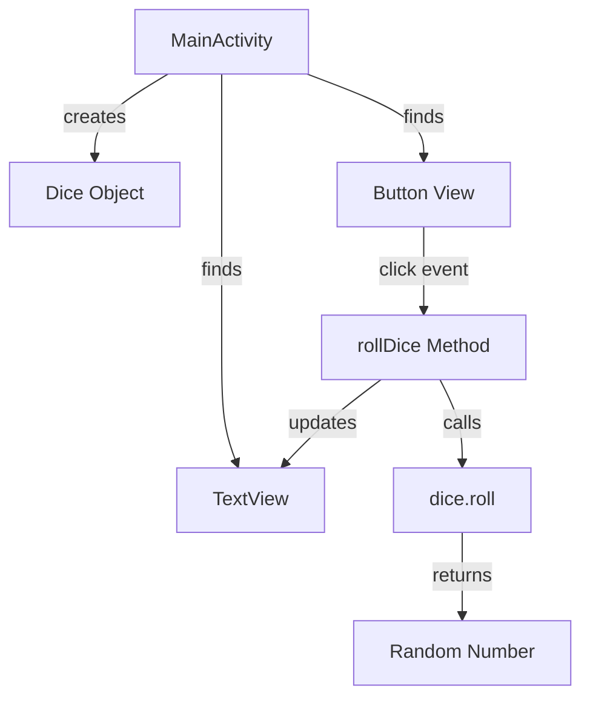

# Dice Roller App - Flow Documentation

This document provides comprehensive documentation of the application flow, architecture patterns, and interaction models used in the Dice Roller Android application.

## Table of Contents

1. [Application Architecture](#application-architecture)
2. [User Interaction Flow](#user-interaction-flow)
3. [Component Lifecycle](#component-lifecycle)
4. [Data Flow Patterns](#data-flow-patterns)
5. [UI State Management](#ui-state-management)
6. [Event Handling](#event-handling)
7. [Performance Considerations](#performance-considerations)
8. [Error Handling Strategy](#error-handling-strategy)

## Application Architecture

### Architectural Pattern: Model-View-Activity (MVA)

The Dice Roller app implements a simplified MVA pattern:

```
┌─────────────────┐    ┌─────────────────┐    ┌─────────────────┐
│     MODEL       │    │      VIEW       │    │   ACTIVITY      │
│                 │    │                 │    │                 │
│   Dice Class    │◄───┤  activity_main  │◄───┤  MainActivity   │
│   - numSides    │    │  - Button       │    │  - onCreate()   │
│   - roll()      │    │  - TextView     │    │  - rollDice()   │
│                 │    │                 │    │                 │
└─────────────────┘    └─────────────────┘    └─────────────────┘
```

#### Model Layer
- **Dice Class**: Encapsulates dice rolling logic
- **Responsibilities**: Random number generation, business rules
- **Dependencies**: None (pure Kotlin)

#### View Layer
- **XML Layout**: Defines UI structure and appearance
- **Components**: Button for interaction, TextView for display
- **Responsibilities**: User interface presentation

#### Activity Layer
- **MainActivity**: Coordinates between Model and View
- **Responsibilities**: Event handling, UI updates, lifecycle management

### Component Relationships



## User Interaction Flow

### Primary Flow: Dice Rolling

```
┌─────────────────┐
│   App Launch   │
└─────┬───────────┘
      │
      ▼
┌─────────────────┐
│  UI Initialize  │
│  - Load layout  │
│  - Find views   │
│  - Set listeners│
└─────┬───────────┘
      │
      ▼
┌─────────────────┐
│   Idle State    │◄──────────┐
│ Waiting for     │           │
│ user input      │           │
└─────┬───────────┘           │
      │                       │
      ▼                       │
┌─────────────────┐           │
│  Button Tap     │           │
│   Detected      │           │
└─────┬───────────┘           │
      │                       │
      ▼                       │
┌─────────────────┐           │
│  Create Dice    │           │
│   Object        │           │
└─────┬───────────┘           │
      │                       │
      ▼                       │
┌─────────────────┐           │
│   Roll Dice     │           │
│ Generate random │           │
└─────┬───────────┘           │
      │                       │
      ▼                       │
┌─────────────────┐           │
│  Update UI      │           │
│ Display result  │           │
└─────┬───────────┘           │
      │                       │
      └───────────────────────┘
```

### Detailed Step-by-Step Flow

#### Step 1: Application Initialization
```kotlin
// System creates MainActivity instance
// Calls onCreate() method
override fun onCreate(savedInstanceState: Bundle?) {
    super.onCreate(savedInstanceState)
    // Inflates layout from XML resource
    setContentView(R.layout.activity_main)
    
    // Finds button view by ID
    val rollButton: Button = findViewById(R.id.button2)
    
    // Attaches click listener
    rollButton.setOnClickListener { rollDice() }
}
```

#### Step 2: User Interface Setup
- Layout inflation from `activity_main.xml`
- View binding and reference creation
- Event listener registration
- Initial UI state establishment

#### Step 3: Event Detection and Processing
```kotlin
// Click event triggers lambda function
rollButton.setOnClickListener { rollDice() }

// rollDice() method execution begins
private fun rollDice() {
    // Create new Dice instance
    val dice = Dice(6)
    
    // Generate random number
    val diceRoll = dice.roll()
    
    // Update UI
    val resultTextView: TextView = findViewById(R.id.textView)
    resultTextView.text = diceRoll.toString()
}
```

#### Step 4: Random Number Generation
```kotlin
class Dice(private val numSides: Int) {
    fun roll(): Int {
        // Generates random number in range [1, numSides]
        return (1..numSides).random()
    }
}
```

#### Step 5: UI State Update
- TextView content is updated with new result
- UI reflects the new dice roll value
- App returns to idle state awaiting next interaction

## Component Lifecycle

### MainActivity Lifecycle States

```
┌─────────────────┐
│    CREATED      │
│   onCreate()    │
└─────┬───────────┘
      │
      ▼
┌─────────────────┐
│    STARTED      │
│   onStart()     │
└─────┬───────────┘
      │
      ▼
┌─────────────────┐
│    RESUMED      │
│   onResume()    │ ←──────┐
│  (ACTIVE)       │        │
└─────┬───────────┘        │
      │                    │
      ▼                    │
┌─────────────────┐        │
│    PAUSED       │        │
│   onPause()     │        │
└─────┬───────────┘        │
      │                    │
      ├────────────────────┘
      │
      ▼
┌─────────────────┐
│   STOPPED       │
│   onStop()      │
└─────┬───────────┘
      │
      ▼
┌─────────────────┐
│  DESTROYED      │
│  onDestroy()    │
└─────────────────┘
```

### View Lifecycle Integration

```
Activity State     View State       Dice Object
─────────────     ────────────     ─────────────
CREATED       →   Inflated     →   Not created
STARTED       →   Visible      →   Not created  
RESUMED       →   Interactive  →   Created on demand
PAUSED        →   Not focused  →   Eligible for GC
STOPPED       →   Not visible  →   Eligible for GC
DESTROYED     →   Released     →   Released
```

## Data Flow Patterns

### Unidirectional Data Flow

The application follows a simple unidirectional data flow pattern:

```
User Input → Event Handler → Business Logic → UI Update
```

#### Detailed Data Flow

1. **Input Layer**: Touch events from user interaction
2. **Controller Layer**: MainActivity event handlers
3. **Model Layer**: Dice business logic
4. **View Layer**: UI component updates

### State Transitions

```
┌─────────────────┐    Button Click    ┌─────────────────┐
│   Initial UI    │ ──────────────────► │   Processing    │
│   State         │                    │   State         │
│ (empty/default) │                    │ (calculating)   │
└─────────────────┘                    └─────┬───────────┘
          ▲                                   │
          │                                   │ Result Ready
          │                                   │
          │               ┌─────────────────┐ │
          └───────────────┤  Result State   │◄┘
            Ready for     │  (displaying    │
            Next Roll     │   dice value)   │
                         └─────────────────┘
```

### Memory Management

```
Object Lifecycle:
┌─────────────────┐    ┌─────────────────┐    ┌─────────────────┐
│ Button Click    │ →  │ Dice Created    │ →  │ Dice GC'd       │
│                 │    │ Roll Executed   │    │ After Method    │
│                 │    │ Result Returned │    │ Completes       │
└─────────────────┘    └─────────────────┘    └─────────────────┘
```

## UI State Management

### State Variables

The application maintains minimal state:

- **Current Dice Value**: Displayed in TextView
- **Button State**: Enabled/disabled (always enabled in this app)
- **Activity State**: Managed by Android framework

### State Persistence

```
Configuration Changes:
┌─────────────────┐    ┌─────────────────┐    ┌─────────────────┐
│  Original UI    │ →  │  Save State     │ →  │  Restore UI     │
│                 │    │  (None in this  │    │  (Default state)│
│                 │    │   simple app)   │    │                 │
└─────────────────┘    └─────────────────┘    └─────────────────┘
```

**Note**: This app does not persist dice roll results across configuration changes or app restarts.

## Event Handling

### Event Types and Handlers

#### Touch Events
```kotlin
// Primary interaction: Button click
rollButton.setOnClickListener { rollDice() }
```

#### Event Processing Pipeline
```
Raw Touch Event
      ↓
View System Processing
      ↓
Button onTouch/onClick
      ↓
Lambda Function { rollDice() }
      ↓
Business Logic Execution
      ↓
UI Update
```

### Event Threading

```
Main UI Thread:
┌─────────────────┐    ┌─────────────────┐    ┌─────────────────┐
│  Touch Event    │ →  │  Event Handler  │ →  │  UI Update      │
│  Detected       │    │  Execution      │    │  (TextView)     │
└─────────────────┘    └─────────────────┘    └─────────────────┘
```

**Note**: All operations in this app run on the main UI thread due to their lightweight nature.

## Performance Considerations

### Memory Usage

- **Object Creation**: New Dice instance per roll (minimal impact)
- **String Allocation**: Result conversion to string (temporary)
- **View References**: Cached findViewById results could be optimized

### CPU Usage

- **Random Generation**: O(1) operation
- **UI Updates**: Minimal text change operation
- **Overall Complexity**: O(1) per dice roll

### Optimization Opportunities

1. **View Binding**: Use ViewBinding instead of findViewById
2. **Object Reuse**: Reuse single Dice instance
3. **String Optimization**: Use string builder for complex formatting

### Performance Metrics

```
Operation          Time Complexity    Memory Impact
─────────────     ─────────────────   ──────────────
Dice Creation     O(1)               ~24 bytes
Random Gen        O(1)               0 bytes  
UI Update         O(1)               ~String bytes
Total Per Roll    O(1)               < 100 bytes
```

## Error Handling Strategy

### Exception Types and Handling

#### Potential Exceptions
1. **NullPointerException**: View not found
2. **OutOfMemoryError**: Unlikely in this simple app
3. **Security Exception**: Random number generation (highly unlikely)

#### Error Prevention
```kotlin
// Safe view finding with null checks (recommended enhancement)
val rollButton: Button? = findViewById(R.id.button2)
rollButton?.setOnClickListener { rollDice() }

// Safe dice creation with validation (recommended enhancement)
class Dice(private val numSides: Int) {
    init {
        require(numSides > 0) { "Dice must have at least 1 side" }
    }
    
    fun roll(): Int {
        return (1..numSides).random()
    }
}
```

### Error Recovery Strategies

```
Error Scenario          Recovery Strategy
──────────────         ─────────────────
View Not Found    →    Graceful degradation / App crash (design decision)
Invalid Dice      →    Default to 6-sided dice
Random Gen Fail   →    Use fallback number (e.g., 1)
UI Update Fail    →    Log error, continue operation
```

### Debugging Flow

```
Issue Detected
      ↓
Check Logs (Logcat)
      ↓
Identify Component (Activity/View/Model)
      ↓
Trace Event Flow
      ↓
Isolate Root Cause
      ↓
Apply Fix
      ↓
Test Resolution
```

---

## Conclusion

This flow documentation provides a comprehensive view of how the Dice Roller app operates from both technical and user perspectives. The simple architecture makes it an excellent learning project while demonstrating core Android development concepts including activity lifecycle, event handling, UI updates, and basic object-oriented design patterns.

The unidirectional data flow and minimal state management make the app predictable and easy to debug, while the component separation provides a foundation that could be extended for more complex features in the future.