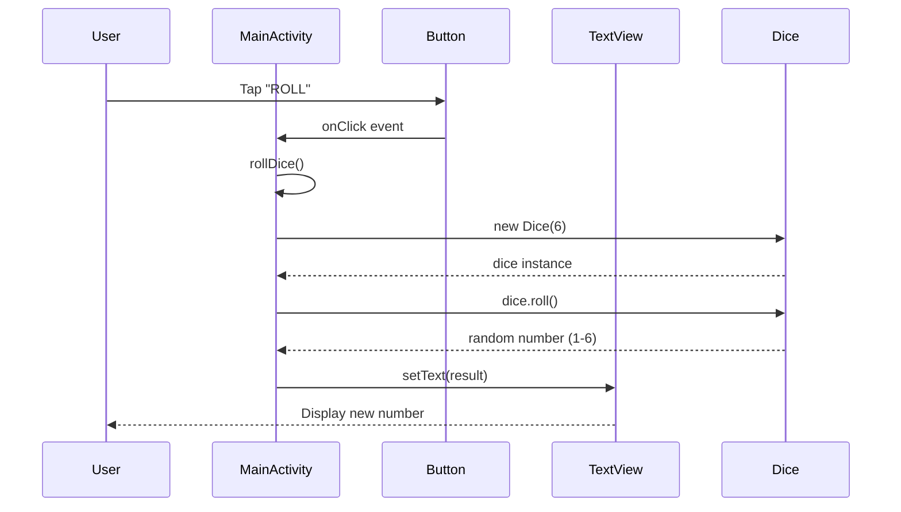

# Dice Roller Android App

A simple Android application that allows users to roll a virtual 6-sided dice and view the result on the screen.

## Features

- 🎲 Roll a 6-sided dice with a single button tap
- 📱 Clean and simple user interface
- 🔢 Display dice roll results instantly
- 📐 Built with modern Android development practices

## Application Flow

### High-Level Flow Description

The Dice Roller app follows a straightforward user interaction pattern designed for simplicity and ease of use:

#### 1. **Application Launch**
```
User launches app → MainActivity is created → UI layout is inflated → Ready state
```
- The app starts with `MainActivity.onCreate()`
- The layout (`activity_main.xml`) is loaded, displaying:
  - A centered `TextView` for showing dice results
  - A "ROLL" button below the text view
- The UI enters a ready state, waiting for user interaction

#### 2. **User Interaction Flow**
```
User taps "ROLL" button → rollDice() method called → Random number generated → UI updated
```
- **Trigger**: User taps the "ROLL" button
- **Action**: Button's `OnClickListener` invokes `rollDice()` method
- **Processing**: 
  - New `Dice(6)` object is instantiated
  - `dice.roll()` generates random number between 1-6
  - Result is stored in `diceRoll` variable
- **Display**: `TextView` is updated with the new dice value

#### 3. **State Management**
```
Initial state → User interaction → Result display → Ready for next interaction
```
- **Initial State**: App shows empty or default text view
- **Active State**: During dice roll calculation (instantaneous)
- **Result State**: Display shows the rolled number (1-6)
- **Ready State**: App returns to waiting for next user interaction

#### 4. **Repeat Cycle**
```
Result displayed → User can immediately tap "ROLL" again → New result generated
```
- No cooldown or delay between rolls
- Each roll is independent and generates a fresh random result
- Previous results are not stored or displayed

### Technical Flow Architecture

#### Component Interaction Diagram
```
MainActivity
    │
    ├── UI Components
    │   ├── Button (id: button2) ──┐
    │   └── TextView (id: textView) │
    │                              │
    └── Business Logic             │
        └── rollDice() method ←────┘
            │
            └── Dice class
                └── roll() method
                    └── Random number generation
```

#### Data Flow
1. **Input**: User button press (UI event)
2. **Processing**: Random number generation (1-6 range)
3. **Output**: Display update (TextView content change)

#### Event Flow Sequence


### Key Algorithms

#### Random Number Generation
- **Algorithm**: Kotlin's `(1..numSides).random()`
- **Range**: Inclusive range from 1 to 6
- **Distribution**: Uniform probability (each number has 1/6 chance)
- **Seed**: Uses system default random seed for unpredictability

#### UI Update Pattern
- **Method**: Direct reference to TextView via `findViewById()`
- **Update**: Immediate synchronous update on UI thread
- **Format**: Simple integer-to-string conversion

### Error Handling & Edge Cases

#### Current Implementation
- **No explicit error handling**: Relies on Android framework stability
- **No input validation**: Button click is the only input method
- **No state persistence**: Results are not saved across app lifecycle

#### Potential Edge Cases (Handled by Framework)
- Device rotation: Android handles activity recreation
- Memory pressure: Android manages activity lifecycle
- Button spam-clicking: Each click processes independently

### Performance Characteristics

#### Time Complexity
- **Random generation**: O(1) constant time
- **UI update**: O(1) constant time  
- **Overall**: O(1) per dice roll

#### Memory Usage
- **Dice object**: Lightweight, single integer field
- **No state accumulation**: Previous results are not stored
- **Memory footprint**: Minimal, suitable for low-end devices

#### Scalability Considerations
- **Single dice limitation**: Current design supports only one die
- **No history**: Results are not accumulated or stored
- **Extension potential**: Architecture supports easy enhancement for multiple dice

### User Experience Flow

#### Typical User Journey
1. **Discovery**: User opens app from launcher
2. **Understanding**: Clear UI indicates dice rolling function
3. **Interaction**: Single tap to roll dice
4. **Feedback**: Immediate visual result
5. **Repetition**: Seamless re-rolling experience

#### Accessibility Considerations
- **Visual**: Large text size (36sp) for readability
- **Motor**: Large button target for easy tapping
- **Cognitive**: Simple, single-action interface

## Screenshots

*Add screenshots of your app here*

## Tech Stack

- **Language**: Kotlin
- **Platform**: Android
- **Min SDK**: API level as configured
- **Build Tool**: Gradle with Kotlin DSL
- **Architecture**: Simple Activity-based architecture
- **UI Framework**: Android Views with ConstraintLayout

## Project Structure

```
app/
├── src/
│   ├── main/
│   │   ├── java/com/example/diceroller/
│   │   │   └── MainActivity.kt          # Main activity with dice rolling logic
│   │   ├── res/
│   │   │   ├── layout/
│   │   │   │   └── activity_main.xml    # Main UI layout
│   │   │   ├── values/
│   │   │   │   ├── strings.xml          # App strings
│   │   │   │   ├── colors.xml           # Color definitions
│   │   │   │   └── themes.xml           # App themes
│   │   │   └── ...                      # Other resources
│   │   └── AndroidManifest.xml          # App manifest
│   ├── test/                            # Unit tests
│   └── androidTest/                     # Instrumented tests
└── build.gradle.kts                     # Module build configuration
```

## Getting Started

### Prerequisites

- Android Studio Arctic Fox or later
- JDK 8 or higher
- Android SDK with API level 21+ (recommended)

### Installation

1. **Clone the repository**
   ```bash
   git clone <repository-url>
   cd diceroller
   ```

2. **Open in Android Studio**
   - Launch Android Studio
   - Select "Open an existing Android Studio project"
   - Navigate to the project directory and select it

3. **Build the project**
   - Let Android Studio sync the project
   - Build the project using `Build > Make Project` or `Ctrl+F9`

4. **Run the app**
   - Connect an Android device or start an emulator
   - Click the "Run" button or press `Shift+F10`

### Building from Command Line

```bash
# Build debug APK
./gradlew assembleDebug

# Run tests
./gradlew test

# Run instrumented tests
./gradlew connectedAndroidTest
```

## How to Use

1. Launch the Dice Roller app
2. Tap the "ROLL" button
3. View the dice roll result displayed on the screen
4. Tap the button again to roll the dice again

## Code Overview

### Main Components

- **MainActivity**: The main activity that handles the user interface and dice rolling logic
- **Dice**: A simple data class that represents a dice with configurable number of sides

### Key Features in Code

```kotlin
class Dice(private val numSides: Int) {
    fun roll(): Int {
        return (1..numSides).random()
    }
}
```

The `Dice` class uses Kotlin's built-in `random()` function to generate random numbers within the specified range.

### Application Lifecycle

#### Activity Lifecycle Flow
```kotlin
onCreate() → setContentView() → findViewById() → setOnClickListener()
    ↓
User interaction triggers rollDice()
    ↓
New dice roll generated and displayed
```

#### Key Methods
- **`onCreate()`**: Initializes UI and sets up event listeners
- **`rollDice()`**: Core business logic for dice rolling
- **`Dice.roll()`**: Random number generation algorithm

## Contributing

1. Fork the repository
2. Create a feature branch (`git checkout -b feature/amazing-feature`)
3. Commit your changes (`git commit -m 'Add some amazing feature'`)
4. Push to the branch (`git push origin feature/amazing-feature`)
5. Open a Pull Request

## Testing

The project includes both unit tests and instrumented tests:

- **Unit Tests**: Located in `app/src/test/` - Test business logic without Android dependencies
- **Instrumented Tests**: Located in `app/src/androidTest/` - Test UI and Android-specific functionality

Run tests using:
```bash
# Unit tests
./gradlew test

# Instrumented tests (requires device/emulator)
./gradlew connectedAndroidTest
```

## Future Enhancements

- [ ] Add support for different dice types (4-sided, 8-sided, 12-sided, 20-sided)
- [ ] Include dice roll history
- [ ] Add sound effects for dice rolling
- [ ] Implement dice rolling animations
- [ ] Add multiple dice rolling capability
- [ ] Include statistics tracking
- [ ] Add dice roll persistence across app sessions
- [ ] Implement shake-to-roll gesture
- [ ] Add customizable dice themes and colors

## License

This project is licensed under the MIT License - see the [LICENSE](LICENSE) file for details.

## Acknowledgments

- Built following Android development best practices
- Inspired by classic dice rolling applications
- Thanks to the Android development community

---

**Made with ❤️ for learning Android development**