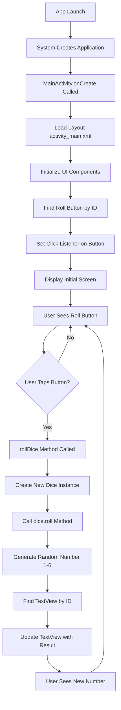

# Dice Roller Android Application - Complete System Documentation

## Table of Contents
1. [System Overview](#system-overview)
2. [Architecture Overview](#architecture-overview)
3. [Project Structure](#project-structure)
4. [Build System](#build-system)
5. [Application Flow](#application-flow)
6. [Component Details](#component-details)
7. [User Interface](#user-interface)
8. [Data Flow](#data-flow)
9. [Configuration Files](#configuration-files)
10. [Testing Strategy](#testing-strategy)
11. [Build and Deployment](#build-and-deployment)
12. [Development Workflow](#development-workflow)

---

## System Overview

### Purpose
The Dice Roller is a simple Android application that allows users to simulate rolling a six-sided dice. Users can tap a button to generate a random number between 1 and 6, which is displayed on the screen.

### Target Platform
- **Platform**: Android
- **Minimum SDK**: API 19 (Android 4.4 KitKat)
- **Target SDK**: API 33 (Android 13)
- **Compile SDK**: API 33
- **Language**: Kotlin
- **Framework**: Android Jetpack/AndroidX

### Key Features
- Single-button dice rolling functionality
- Random number generation (1-6)
- Clean, minimalist user interface
- Material Design 3 theming
- Portrait and landscape orientation support

---

## Architecture Overview

### Application Architecture Pattern
The application follows a **Simple Activity-Based Architecture** suitable for small applications:

```
┌─────────────────────────────────────┐
│           Presentation Layer        │
│  ┌─────────────────────────────────┐ │
│  │        MainActivity             │ │
│  │  - UI Event Handling            │ │
│  │  - View Updates                 │ │
│  └─────────────────────────────────┘ │
└─────────────────────────────────────┘
                    │
                    ▼
┌─────────────────────────────────────┐
│            Business Logic           │
│  ┌─────────────────────────────────┐ │
│  │           Dice Class            │ │
│  │  - Random Number Generation     │ │
│  │  - Dice Rolling Logic           │ │
│  └─────────────────────────────────┘ │
└─────────────────────────────────────┘
                    │
                    ▼
┌─────────────────────────────────────┐
│          Android Framework          │
│  ┌─────────────────────────────────┐ │
│  │      Kotlin Random API          │ │
│  │  - System Random Number Gen     │ │
│  └─────────────────────────────────┘ │
└─────────────────────────────────────┘
```

### Technology Stack
- **Language**: Kotlin 1.9.0
- **Build System**: Gradle with Kotlin DSL
- **UI Framework**: Android Views with ConstraintLayout
- **Theming**: Material Design 3
- **Testing**: JUnit 4, Espresso
- **IDE**: Android Studio

---

## Project Structure

```
DiceRoller/
├── .git/                           # Git version control
├── .idea/                          # Android Studio project files
├── app/                            # Main application module
│   ├── build.gradle.kts           # App-level build configuration
│   ├── proguard-rules.pro         # ProGuard/R8 obfuscation rules
│   └── src/
│       ├── androidTest/           # Instrumented tests
│       │   └── java/com/example/diceroller/
│       │       └── ExampleInstrumentedTest.kt
│       ├── main/                  # Main source code
│       │   ├── AndroidManifest.xml
│       │   ├── java/com/example/diceroller/
│       │   │   └── MainActivity.kt
│       │   └── res/               # Resources
│       │       ├── drawable/      # Vector drawables
│       │       ├── layout/        # UI layouts
│       │       ├── mipmap-*/      # App icons (various densities)
│       │       ├── values/        # String, color, theme resources
│       │       └── xml/           # Configuration files
│       └── test/                  # Unit tests
│           └── java/com/example/diceroller/
│               └── ExampleUnitTest.kt
├── gradle/                        # Gradle wrapper files
├── build.gradle.kts              # Project-level build configuration
├── settings.gradle.kts           # Project settings
├── gradle.properties            # Gradle configuration
└── gradlew                      # Gradle wrapper scripts
```

---

## Build System

### Gradle Configuration

#### Project-Level Build Script (`build.gradle.kts`)
```kotlin
plugins {
    id("com.android.application") version "8.1.2" apply false
    id("org.jetbrains.kotlin.android") version "1.9.0" apply false
}
```

#### Module-Level Build Script (`app/build.gradle.kts`)
- **Application ID**: `com.example.diceroller`
- **Version**: 1.0 (versionCode: 1)
- **Kotlin JVM Target**: 1.8
- **Java Compatibility**: 1.8

#### Dependencies
- **AndroidX Core KTX**: 1.9.0 - Kotlin extensions for Android
- **AppCompat**: 1.6.1 - Backward compatibility support
- **Material Design**: 1.8.0 - Material Design components
- **ConstraintLayout**: 2.1.4 - Flexible layout manager
- **JUnit**: 4.13.2 - Unit testing framework
- **Espresso**: 3.5.1 - UI testing framework

---

## Application Flow

### Complete User Journey Flow



### Detailed Step-by-Step Flow

#### 1. Application Startup
1. **Android System Launch**
   - User taps app icon or launches from recent apps
   - Android system reads AndroidManifest.xml
   - System creates application process

2. **Application Initialization**
   - Android loads Application class (default)
   - System applies theme from manifest
   - Memory allocation and process setup

#### 2. Activity Lifecycle - Creation Phase
1. **MainActivity.onCreate()**
   ```kotlin
   override fun onCreate(savedInstanceState: Bundle?) {
       super.onCreate(savedInstanceState)          // Call parent onCreate
       setContentView(R.layout.activity_main)     // Inflate layout
       
       val rollButton: Button = findViewById(R.id.button2)  // Find button
       rollButton.setOnClickListener { rollDice() }         // Set listener
   }
   ```

2. **Layout Inflation Process**
   - Android inflates activity_main.xml
   - Creates TextView and Button objects
   - Applies ConstraintLayout positioning
   - Sets initial text and styling

3. **View Binding**
   - findViewById locates Button with id "button2"
   - findViewById locates TextView with id "textView"
   - OnClickListener lambda is attached to button

#### 3. User Interaction Flow
1. **Button Press Detection**
   - User taps the "ROLL" button
   - Android touch system detects tap
   - Button's OnClickListener is triggered

2. **Dice Rolling Logic Execution**
   ```kotlin
   private fun rollDice() {
       val dice = Dice(6)                    // Create dice with 6 sides
       val diceRoll = dice.roll()            // Generate random number
       
       val resultTextView: TextView = findViewById(R.id.textView)
       resultTextView.text = diceRoll.toString()  // Update display
   }
   ```

3. **Random Number Generation**
   ```kotlin
   class Dice(private val numSides: Int) {
       fun roll(): Int {
           return (1..numSides).random()     // Kotlin's random function
       }
   }
   ```

4. **UI Update Process**
   - TextView content is updated with new number
   - Android triggers view redraw
   - User sees the new dice roll result

---

## Component Details

### MainActivity Class
```kotlin
class MainActivity : AppCompatActivity()
```

#### Inheritance Hierarchy
- `MainActivity` extends `AppCompatActivity`
- `AppCompatActivity` extends `FragmentActivity`
- `FragmentActivity` extends `ComponentActivity`
- `ComponentActivity` extends `Activity`

#### Key Methods
- **onCreate()**: Initializes the activity, sets content view, binds UI elements
- **rollDice()**: Handles dice rolling logic and UI updates

#### Lifecycle Integration
The activity follows standard Android Activity Lifecycle:
1. onCreate() - Initial setup
2. onStart() - Activity becomes visible
3. onResume() - Activity gets focus
4. onPause() - Activity loses focus
5. onStop() - Activity no longer visible
6. onDestroy() - Activity cleanup

### Dice Class
```kotlin
class Dice(private val numSides: Int) {
    fun roll(): Int {
        return (1..numSides).random()
    }
}
```

#### Design Properties
- **Immutable sides**: `numSides` is set once at creation
- **Pure function**: `roll()` has no side effects
- **Extensible**: Can be configured for different sided dice
- **Thread-safe**: No mutable state

---

## User Interface

### Layout Structure
```xml
<androidx.constraintlayout.widget.ConstraintLayout>
    <TextView
        android:id="@+id/textView"
        android:layout_width="wrap_content"
        android:layout_height="wrap_content"
        android:textSize="36sp"
        [constraints: centered] />
    
    <Button
        android:id="@+id/button2"
        android:layout_width="wrap_content"
        android:layout_height="wrap_content"
        android:text="@string/roll"
        [constraints: below TextView, centered] />
</androidx.constraintlayout.widget.ConstraintLayout>
```

### UI Components Breakdown

#### TextView (Result Display)
- **ID**: `@+id/textView`
- **Purpose**: Displays the dice roll result
- **Text Size**: 36sp (large, readable)
- **Position**: Center of screen
- **Content**: Dynamic (1-6 number)

#### Button (Roll Trigger)
- **ID**: `@+id/button2`
- **Purpose**: Triggers dice rolling action
- **Text**: "ROLL" (from strings.xml)
- **Position**: Below TextView, horizontally centered
- **Style**: Material Design 3 button

#### ConstraintLayout (Container)
- **Purpose**: Manages component positioning
- **Benefits**: Flexible, performant layout
- **Constraints**: Centers components and maintains relationships

### Theme and Styling
- **Theme**: Material Design 3 Day/Night
- **Base Theme**: `Theme.Material3.DayNight.NoActionBar`
- **Benefits**: Automatic dark mode support, modern UI components

---

## Data Flow

### Data Flow Diagram
```
User Input (Button Tap)
         ↓
OnClickListener.onClick()
         ↓
MainActivity.rollDice()
         ↓
new Dice(6)
         ↓
dice.roll()
         ↓
(1..6).random()
         ↓
Kotlin Random Number Generator
         ↓
Return Int (1-6)
         ↓
resultTextView.text = result.toString()
         ↓
Android View System Update
         ↓
UI Refresh
         ↓
User Sees New Number
```

### State Management
- **No Persistent State**: App doesn't save roll history
- **View State**: Only current dice roll value maintained
- **Lifecycle Handling**: State is lost on app restart (by design)

### Memory Management
- **Temporary Objects**: New Dice instance created each roll
- **Garbage Collection**: Automatic cleanup of unused Dice objects
- **View References**: Obtained fresh each roll via findViewById

---

## Configuration Files

### AndroidManifest.xml Analysis
```xml
<manifest xmlns:android="http://schemas.android.com/apk/res/android">
    <application
        android:allowBackup="true"                    <!-- Enable data backup -->
        android:dataExtractionRules="@xml/data_extraction_rules"  <!-- API 31+ backup -->
        android:fullBackupContent="@xml/backup_rules" <!-- Full backup config -->
        android:icon="@mipmap/ic_launcher"           <!-- App icon -->
        android:label="@string/app_name"             <!-- App name: "DiceRoller" -->
        android:theme="@style/Theme.DiceRoller">     <!-- App theme -->
        
        <activity
            android:name=".MainActivity"              <!-- Main activity -->
            android:exported="true">                  <!-- Launchable from outside -->
            <intent-filter>
                <action android:name="android.intent.action.MAIN" />      <!-- Main entry point -->
                <category android:name="android.intent.category.LAUNCHER" /> <!-- Show in launcher -->
            </intent-filter>
        </activity>
    </application>
</manifest>
```

### Resource Files

#### strings.xml
```xml
<resources>
    <string name="app_name">DiceRoller</string>  <!-- Application name -->
    <string name="roll">ROLL</string>            <!-- Button text -->
</resources>
```

#### Benefits of String Resources
- **Localization Ready**: Easy to translate to other languages
- **Consistency**: Same text used everywhere
- **Maintenance**: Change text in one place

---

## Testing Strategy

### Unit Tests (`ExampleUnitTest.kt`)
- **Location**: `app/src/test/java/`
- **Purpose**: Test business logic in isolation
- **Framework**: JUnit 4
- **Scope**: Test Dice class functionality

### Instrumented Tests (`ExampleInstrumentedTest.kt`)
- **Location**: `app/src/androidTest/java/`
- **Purpose**: Test app behavior on device/emulator
- **Framework**: AndroidX Test + Espresso
- **Scope**: Test UI interactions and integration

### Recommended Test Cases

#### Unit Tests for Dice Class
```kotlin
@Test
fun dice_roll_returns_value_in_range() {
    val dice = Dice(6)
    repeat(100) {
        val result = dice.roll()
        assertTrue("Roll result $result not in range 1-6", result in 1..6)
    }
}
```

#### UI Tests for MainActivity
```kotlin
@Test
fun button_click_updates_text_view() {
    onView(withId(R.id.button2)).perform(click())
    onView(withId(R.id.textView)).check(matches(not(withText(""))))
}
```

---

## Build and Deployment

### Build Process Flow
1. **Compilation**
   ```
   Kotlin Source (.kt) → Kotlin Compiler → Java Bytecode (.class)
   ```

2. **Android Build Process**
   ```
   Resources (XML) → AAPT2 → Compiled Resources
   Java Bytecode → DEX Compiler → DEX Files (.dex)
   Native Libraries → Packager → APK
   ```

3. **APK Structure**
   ```
   APK File
   ├── AndroidManifest.xml
   ├── classes.dex (compiled code)
   ├── resources.arsc (compiled resources)
   ├── res/ (resources)
   ├── assets/ (raw files)
   └── META-INF/ (signatures)
   ```

### Build Variants
- **Debug**: Debuggable, unoptimized, with debug symbols
- **Release**: Optimized, minified (if enabled), signed for distribution

### Gradle Build Commands
```bash
# Build debug APK
./gradlew assembleDebug

# Build release APK  
./gradlew assembleRelease

# Run unit tests
./gradlew test

# Run instrumented tests
./gradlew connectedAndroidTest

# Clean build
./gradlew clean
```

---

## Development Workflow

### Setup Requirements
1. **Android Studio**: Latest stable version
2. **Android SDK**: API levels 19-33
3. **Kotlin Plugin**: Enabled in Android Studio
4. **Git**: For version control

### Development Environment
1. **Clone Repository**
   ```bash
   git clone [repository-url]
   cd DiceRoller
   ```

2. **Open in Android Studio**
   - Import Gradle project
   - Sync project with Gradle files
   - Wait for indexing to complete

3. **Run Application**
   - Connect Android device or start emulator
   - Click "Run" button or use Ctrl+R
   - Select target device

### Code Style and Standards
- **Kotlin Coding Conventions**: Follow official Kotlin style guide
- **Android Guidelines**: Follow Android development best practices
- **Naming Conventions**: 
  - Classes: PascalCase (e.g., `MainActivity`)
  - Functions: camelCase (e.g., `rollDice`)
  - Variables: camelCase (e.g., `diceRoll`)
  - Constants: UPPER_SNAKE_CASE

### Version Control Workflow
1. **Feature Development**
   ```bash
   git checkout -b feature/new-feature
   git commit -m "Add new feature"
   git push origin feature/new-feature
   ```

2. **Code Review Process**
   - Create pull request
   - Review code changes
   - Run automated tests
   - Merge to main branch

---

## Performance Considerations

### Memory Usage
- **Lightweight Design**: Minimal memory footprint
- **No Background Services**: App doesn't run background tasks
- **Efficient UI**: Simple view hierarchy for fast rendering

### CPU Usage
- **Minimal Processing**: Only random number generation
- **UI Thread**: All operations suitable for main thread
- **No Heavy Computations**: Instant response to user input

### Battery Usage
- **Minimal Impact**: App only active when user interacts
- **No Network**: No network calls or data usage
- **No Location**: No GPS or location services

---

## Security Considerations

### Data Privacy
- **No Data Collection**: App doesn't collect user data
- **No Network Access**: No internet permissions required
- **Local Only**: All processing happens on device

### Application Security
- **No Sensitive Data**: No passwords or personal information
- **No External Dependencies**: Minimal attack surface
- **Standard Android Security**: Relies on Android platform security

---

## Future Enhancements

### Potential Features
1. **Multiple Dice**: Allow rolling multiple dice at once
2. **Custom Sides**: Configure dice with different numbers of sides
3. **Roll History**: Save and display previous rolls
4. **Statistics**: Show roll frequency and statistics
5. **Animations**: Add visual effects for dice rolling
6. **Sound Effects**: Add audio feedback for rolls
7. **Themes**: Multiple color schemes and themes

### Technical Improvements
1. **Architecture**: Migrate to MVVM with ViewModel and LiveData
2. **Testing**: Increase test coverage with comprehensive test suite
3. **Accessibility**: Improve support for users with disabilities
4. **Internationalization**: Add support for multiple languages
5. **Modern UI**: Migrate to Jetpack Compose for more modern UI

---

## Troubleshooting Guide

### Common Issues
1. **Build Failures**
   - Solution: Clean and rebuild project
   - Check: Gradle sync status and dependencies

2. **App Crashes**
   - Check: Android logs in Logcat
   - Verify: Correct resource IDs in findViewById calls

3. **UI Not Updating**
   - Verify: TextView reference is correct
   - Check: UI updates happen on main thread

### Debug Process
1. **Enable Debug Mode**: Use debug build variant
2. **Set Breakpoints**: In MainActivity.rollDice() method
3. **Inspect Variables**: Check dice roll values
4. **Step Through Code**: Verify execution flow

---

## Conclusion

The Dice Roller application represents a well-structured, simple Android application that demonstrates fundamental Android development concepts:

- **Activity Lifecycle Management**
- **View Binding and Event Handling**
- **Resource Management**
- **Object-Oriented Programming**
- **Material Design Implementation**

Despite its simplicity, the application follows Android best practices and provides a solid foundation that can be extended with additional features and complexity as needed.

The modular design, clear separation of concerns, and comprehensive documentation make it an excellent reference implementation for basic Android application development patterns.